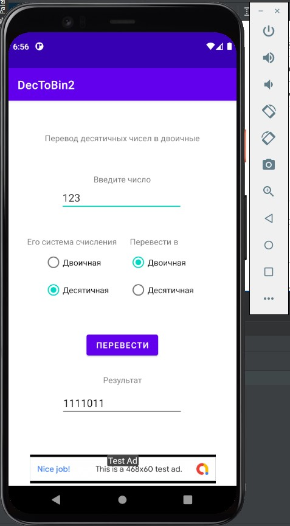

# DecToBin2
 
# Main activity code:
 
    package com.example.dectobin2;

    import androidx.annotation.NonNull;
    import androidx.appcompat.app.AppCompatActivity;

    import android.os.Bundle;

    import com.google.android.gms.ads.AdListener;
    import com.google.android.gms.ads.AdRequest;
    import com.google.android.gms.ads.AdView;
    import com.google.android.gms.ads.LoadAdError;
    import com.google.android.gms.ads.MobileAds;

    import com.google.android.gms.ads.MobileAds;
    import com.google.android.gms.ads.initialization.InitializationStatus;
    import com.google.android.gms.ads.initialization.OnInitializationCompleteListener;

    import android.view.View;
    import android.view.View.OnClickListener;
    import android.widget.Button;
    import android.widget.EditText;
    import android.widget.RadioButton;
    import android.widget.Toast;

    public class MainActivity extends AppCompatActivity implements OnClickListener{

    private Button Convert;

    @Override
    protected void onCreate(Bundle savedInstanceState) {
        super.onCreate(savedInstanceState);
        setContentView(R.layout.activity_main);

        AdView mAdView = findViewById(R.id.adView);
        AdRequest adRequest = new AdRequest.Builder().build();
        mAdView.loadAd(adRequest);

        mAdView.setAdListener(new AdListener() {
            @Override
            public void onAdLoaded() {
                // Code to be executed when an ad finishes loading.
            }

            @Override
            public void onAdFailedToLoad(@NonNull LoadAdError adError) {
                // Code to be executed when an ad request fails.
            }

            @Override
            public void onAdOpened() {
                // Code to be executed when an ad opens an overlay that
                // covers the screen.
            }

            @Override
            public void onAdClicked() {
                // Code to be executed when the user clicks on an ad.
            }

            @Override
            public void onAdClosed() {
                // Code to be executed when the user is about to return
                // to the app after tapping on an ad.
            }
        });

        Convert = (Button) findViewById(R.id.Convert);
        Convert.setOnClickListener((OnClickListener) this);
    }

    @Override
    public void onClick(View v)
    {
        RadioButton radio_dec_from, radio_bin_from, radio_dec_to, radio_bin_to;

        radio_dec_from = (RadioButton) findViewById(R.id.radio_dec_from);
        radio_bin_from = (RadioButton) findViewById(R.id.radio_bin_from);
        radio_dec_to = (RadioButton) findViewById(R.id.radio_dec_to);
        radio_bin_to = (RadioButton) findViewById(R.id.radio_bin_to);

        if (radio_dec_from.isChecked()){
            if (radio_bin_to.isChecked()){
                if(Convert.equals(v))
                {
                    int dec = -1;

                    EditText decText = (EditText) findViewById(R.id.Number);
                    String decStr = decText.getText().toString();

                    if(decStr.length() > 0 && decStr.length() < 9)
                    {
                        dec = Integer.parseInt(decStr);
                    }
                    else{
                        Toast toast = Toast.makeText(getApplicationContext(),
                                "Неверный диапазон значений", Toast.LENGTH_SHORT);
                        toast.show();
                    }

                    if(dec >= 0)
                    {
                        String bin = "";
                        while(dec != 0)
                        {
                            if(dec % 2 == 0)
                            {
                                bin = "0" + bin;
                            }
                            else
                            {
                                bin = "1" + bin;
                            }
                            dec = dec / 2;

                            EditText binText = (EditText) findViewById(R.id.Result);
                            binText.setText(bin);
                        }
                    }
                }
            }
            else{
                EditText decText = (EditText) findViewById(R.id.Number);
                String decStr = decText.getText().toString();

                EditText binText = (EditText) findViewById(R.id.Result);
                binText.setText(decStr);
            }
        }
        else{
            String regex = "[0-1]*";
            EditText decText = (EditText) findViewById(R.id.Number);
            String decStrtest = decText.getText().toString();
            if (!decStrtest.matches(regex)){
                Toast toast = Toast.makeText(getApplicationContext(),
                        "Число должно быть двоичным", Toast.LENGTH_SHORT);
                toast.show();
            }
            else{
                if(radio_dec_to.isChecked()){
                    String decStr = decText.getText().toString();

                    int decimalValue = Integer.parseInt(decStr, 2);

                    EditText binText = (EditText) findViewById(R.id.Result);
                    binText.setText(String.valueOf(decimalValue));
                }
                else{
                    String decStr = decText.getText().toString();

                    EditText binText = (EditText) findViewById(R.id.Result);
                    binText.setText(decStr);
                }
            }

        }

    }

    }
  
# Activity main XAML

    <?xml version="1.0" encoding="utf-8"?>
    <androidx.constraintlayout.widget.ConstraintLayout xmlns:android="http://schemas.android.com/apk/res/android"
        xmlns:app="http://schemas.android.com/apk/res-auto"
        xmlns:tools="http://schemas.android.com/tools"
        android:layout_width="match_parent"
        android:layout_height="match_parent"
        tools:context=".MainActivity">

    <EditText
        android:id="@+id/Result"
        android:layout_width="wrap_content"
        android:layout_height="wrap_content"
        android:layout_marginBottom="52dp"
        android:ems="10"
        android:enabled="true"
        android:inputType="number"
        app:layout_constraintBottom_toTopOf="@+id/adView"
        app:layout_constraintEnd_toEndOf="parent"
        app:layout_constraintHorizontal_bias="0.497"
        app:layout_constraintStart_toStartOf="parent"
        app:layout_constraintTop_toBottomOf="@+id/Convert"
        app:layout_constraintVertical_bias="0.795" />

    <TextView
        android:id="@+id/textView7"
        android:layout_width="wrap_content"
        android:layout_height="wrap_content"
        android:layout_marginTop="32dp"
        android:layout_marginBottom="8dp"
        android:text="Результат"
        app:layout_constraintBottom_toTopOf="@+id/Result"
        app:layout_constraintEnd_toEndOf="parent"
        app:layout_constraintHorizontal_bias="0.502"
        app:layout_constraintStart_toStartOf="parent"
        app:layout_constraintTop_toBottomOf="@+id/Convert"
        app:layout_constraintVertical_bias="1.0" />

    <EditText
        android:id="@+id/Number"
        android:layout_width="wrap_content"
        android:layout_height="wrap_content"
        android:ems="10"
        android:inputType="number"
        app:layout_constraintBottom_toBottomOf="parent"
        app:layout_constraintEnd_toEndOf="parent"
        app:layout_constraintHorizontal_bias="0.492"
        app:layout_constraintStart_toStartOf="parent"
        app:layout_constraintTop_toTopOf="parent"
        app:layout_constraintVertical_bias="0.234" />

    <TextView
        android:id="@+id/textView2"
        android:layout_width="wrap_content"
        android:layout_height="wrap_content"
        android:text="Перевод десятичных чисел в двоичные"
        app:layout_constraintBottom_toBottomOf="parent"
        app:layout_constraintEnd_toEndOf="parent"
        app:layout_constraintStart_toStartOf="parent"
        app:layout_constraintTop_toTopOf="parent"
        app:layout_constraintVertical_bias="0.085" />

    <com.google.android.gms.ads.AdView
        android:id="@+id/adView"
        android:layout_width="wrap_content"
        android:layout_height="wrap_content"
        android:layout_alignParentBottom="true"
        android:layout_centerHorizontal="true"
        android:layout_marginBottom="4dp"
        app:adSize="BANNER"
        app:adUnitId="ca-app-pub-3940256099942544/6300978111"
        app:layout_constraintBottom_toBottomOf="parent"
        app:layout_constraintEnd_toEndOf="parent"
        app:layout_constraintHorizontal_bias="0.516"
        app:layout_constraintStart_toStartOf="parent"
        tools:ignore="MissingConstraints"></com.google.android.gms.ads.AdView>

    <RadioGroup
        android:id="@+id/radioGroupRight"
        android:layout_width="143dp"
        android:layout_height="95dp"
        android:orientation="vertical"
        app:layout_constraintBottom_toBottomOf="parent"
        app:layout_constraintEnd_toEndOf="parent"
        app:layout_constraintHorizontal_bias="0.832"
        app:layout_constraintStart_toStartOf="parent"
        app:layout_constraintTop_toTopOf="parent"
        app:layout_constraintVertical_bias="0.448">

        <RadioButton
            android:id="@+id/radio_bin_to"
            android:layout_width="match_parent"
            android:layout_height="wrap_content"
            android:layout_marginRight="20dp"
            android:layout_weight="1"
            android:text="Двоичная"
            android:checked="true"/>

        <RadioButton
            android:id="@+id/radio_dec_to"
            android:layout_width="match_parent"
            android:layout_height="wrap_content"
            android:layout_marginRight="20dp"
            android:layout_weight="1"
            android:text="Десятичная" />

    </RadioGroup>

    <TextView
        android:id="@+id/textView"
        android:layout_width="wrap_content"
        android:layout_height="wrap_content"
        android:text="Введите число"
        app:layout_constraintBottom_toTopOf="@+id/Number"
        app:layout_constraintEnd_toEndOf="parent"
        app:layout_constraintStart_toStartOf="parent"
        app:layout_constraintTop_toBottomOf="@+id/textView2"
        app:layout_constraintVertical_bias="1.0" />

    <TextView
        android:id="@+id/textView4"
        android:layout_width="wrap_content"
        android:layout_height="wrap_content"
        android:layout_marginTop="156dp"
        android:text="Перевести в"
        app:layout_constraintBottom_toTopOf="@+id/radioGroupRight"
        app:layout_constraintEnd_toEndOf="parent"
        app:layout_constraintHorizontal_bias="0.677"
        app:layout_constraintStart_toStartOf="parent"
        app:layout_constraintTop_toBottomOf="@+id/textView2"
        tools:ignore="MissingConstraints"
        android:textAlignment="center"/>

    <RadioGroup
        android:id="@+id/radioGroupLeft"
        android:layout_width="143dp"
        android:layout_height="95dp"
        android:orientation="vertical"
        app:layout_constraintBottom_toBottomOf="parent"
        app:layout_constraintEnd_toEndOf="parent"
        app:layout_constraintHorizontal_bias="0.167"
        app:layout_constraintStart_toStartOf="parent"
        app:layout_constraintTop_toTopOf="parent"
        app:layout_constraintVertical_bias="0.448">

        <RadioButton
            android:id="@+id/radio_bin_from"
            android:layout_width="match_parent"
            android:layout_height="wrap_content"
            android:layout_marginLeft="20dp"
            android:layout_weight="1"
            android:text="Двоичная"
            android:checked="true" />

        <RadioButton
            android:id="@+id/radio_dec_from"
            android:layout_width="match_parent"
            android:layout_height="wrap_content"
            android:layout_marginLeft="20dp"
            android:layout_weight="1"
            android:text="Десятичная" />

    </RadioGroup>

    <TextView
        android:id="@+id/textView3"
        android:layout_width="wrap_content"
        android:layout_height="wrap_content"
        android:layout_marginTop="156dp"
        android:text="Его система счисления"
        app:layout_constraintBottom_toTopOf="@+id/radioGroupLeft"
        app:layout_constraintEnd_toEndOf="parent"
        app:layout_constraintHorizontal_bias="0.135"
        app:layout_constraintStart_toStartOf="parent"
        app:layout_constraintTop_toBottomOf="@+id/textView2"
        tools:ignore="MissingConstraints"
        android:textAlignment="center"/>

    <Button
        android:id="@+id/Convert"
        android:layout_width="wrap_content"
        android:layout_height="wrap_content"
        android:text="Перевести"
        app:layout_constraintBottom_toBottomOf="parent"
        app:layout_constraintEnd_toEndOf="parent"
        app:layout_constraintStart_toStartOf="parent"
        app:layout_constraintTop_toBottomOf="@+id/radioGroupRight"
        app:layout_constraintVertical_bias="0.178" />

    </androidx.constraintlayout.widget.ConstraintLayout>
    
 # Интерфейс
 
 

